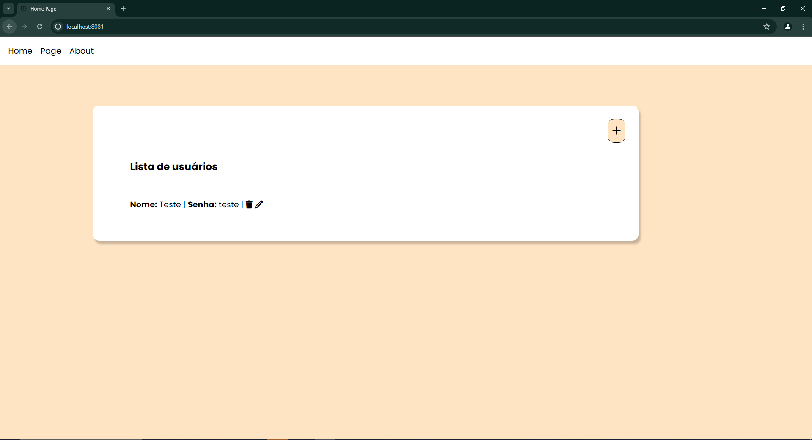

# Home Page
A small project build with NodeJs, Express, Sequelize and Handlebars, that join together all my learning of those last few days with JavaScript back-end, that isn't supposed to be any front-end friendly but made with a simple a pretty interface. The biggest focus, was make the basic concepts of any system using those tools.

# How to run

First of all you will need to install the tools that in needed run the project locally, NodeJS and MySQL who can be found in the following links:

[node](https://nodejs.org/)

[mysql](https://www.mysql.com/downloads/)

Follow the pages instructions to know how to get all set in your computer

After that you can follow the create_db.sql to make a custom user and set the database, with instructions if you just want user you root MySQL account anyway.

In that point, you can go to your terminal/cmd and Just type:

```
npm install
```

This will install all the needed packages to the project run normally, then if all go without any error appear ( check your node install if this happens ), you can also type the following command:

```
nodemon ./app.js
```
or
```
node ./app.js
```
Then just open your browser in [localhost](https://localhost:8081) and all should be appearing.

# Screenshots



